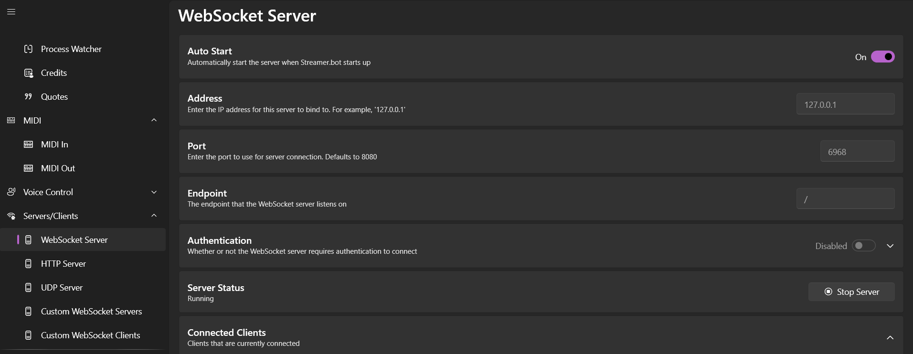

# Widget - Rython Task Bot v2

Optional widget for [Rython Task Bot v2](https://github.com/liyunze-coding/rython-task-bot-v2)

## Instructions

Websocket server running is required for browser source to work. 

> 

1. Streamer.Bot -> Servers/Clients -> Websocket Server
2. Auto Start: `ON`; Click on `Start Server`
3. If port number already taken, change port number
4. Ensure that [config.js](./config.js)'s websocket settings are in-sync with Streamer.Bot's 